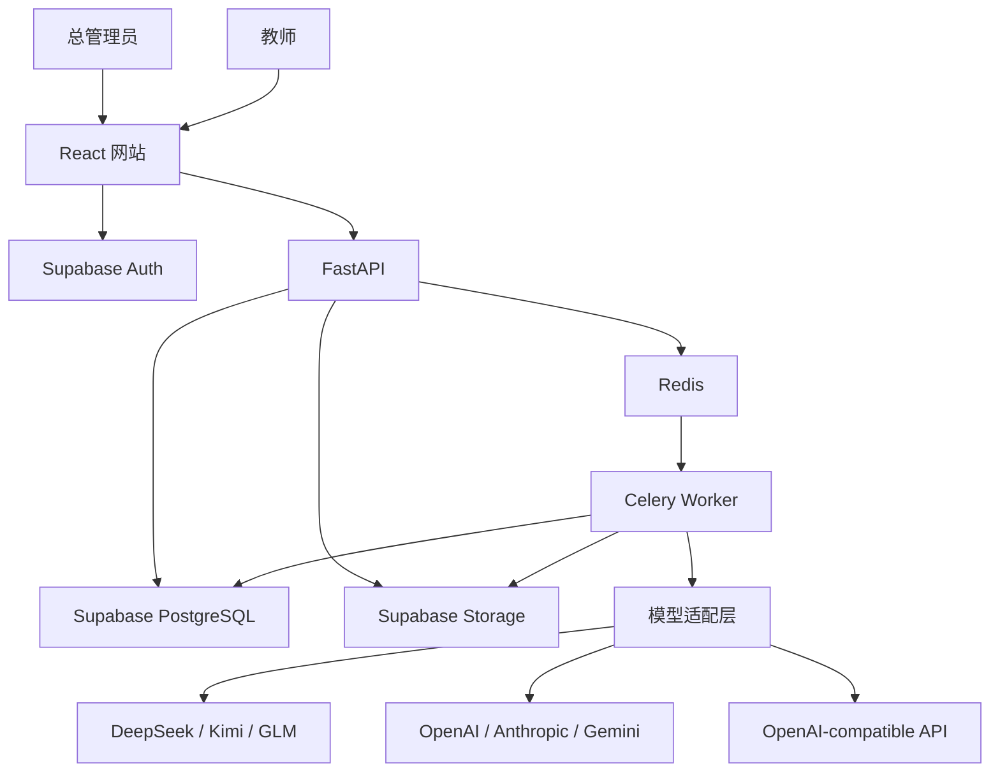

# 系统架构

## 1. 总体调用关系

## 2. 模块职责

| 模块/目录 | 职责 |
|---|---|
| `frontend/` | 登录、管理、作业、上传、批次进度、复核和导出界面 |
| `frontend/src/app/` | App Shell、路由、双语文案、界面状态和设计变量 |
| `frontend/src/features/auth/` | Supabase 浏览器会话、FastAPI 当前账户校验和权限守卫 |
| `frontend/src/routes/auth/` | 登录、找回密码、邀请与恢复回调设密 |
| `frontend/src/routes/admin/users/` | 教师列表、邀请、停用和启用界面 |
| `frontend/src/routes/admin/providers/` | 供应商配置、连接测试、启停和 Key 不回显界面 |
| `frontend/src/features/assignments/` | 作业列表、创建、本地文本导入和阶段 6 前端流程测试 |
| `frontend/src/features/rubrics/` | Rubric 生成、确认、历史版本和结构化结果界面 |
| `frontend/src/features/submissions/` | 论文选择、客户端批次预检、逐文件上传、状态列表和短时下载入口 |
| `backend/app/api/` | 对外 HTTP 接口、参数校验和权限入口 |
| `backend/app/config.py` | 显式校验运行环境和 PostgreSQL 连接配置 |
| `backend/app/db.py` | 创建有上限的应用连接池和异步数据库会话 |
| `backend/app/readiness.py` | 执行有超时限制的数据库就绪探针 |
| `backend/app/auth/` | 在线验证 Supabase 会话、合并 profile 状态、管理邀请与唯一管理员引导 |
| `backend/app/domain/` | 11 张业务表、Rubric 和统一评分输入/输出的严格领域契约 |
| `backend/migrations/` | 唯一 Alembic 迁移版本链，负责表结构、约束、索引和 RLS |
| `backend/app/providers/` | 供应商安全配置、七类评分适配器、能力/价格快照、Schema 投影、用量标准化、SSRF 防护和模型目录 |
| `backend/app/rubrics/` | 作业/Rubric 仓储、业务状态机和严格模型结构化调用 |
| `backend/app/security/` | 使用版本化 AES-256-GCM 加解密供应商 API Key |
| `backend/app/parsing/` | 将 DOCX/PDF 转换为可定位的规范文本块 |
| `backend/app/storage/` | 私有 Supabase Storage 上传、读取、签名 URL 和对象生命周期 |
| `backend/app/submissions/` | 论文去重预留、RLS 仓储、解析状态机、失败重试和对象补偿 |
| `backend/app/grading/` | 构建版本化提示词、隔离不可信正文、校验证据并确定性计算总分 |
| `backend/scripts/` | 只用于受控验收的本地脚本；不承载生产请求逻辑 |
| `backend/app/workers/` | Celery 批量调度、幂等、重试和状态更新 |
| `backend/app/export/` | 生成草稿和最终成绩 Excel |
| `infra/` | Render、Supabase Storage、健康检查和维护任务配置；当前只落地前端与 API Blueprint |
| `docs/design/` | App Shell 概念图和可执行视觉规范 |
| `e2e/` | 管理员与教师的浏览器全流程测试 |

## 3. 核心数据流

### 账户

1. 生产 API 启动时确认 Supabase 已关闭公开注册，否则拒绝启动。
2. 一次性命令发送首个管理员邀请，并把对应 profile 提升为唯一 `active admin`。
3. 管理员通过后端邀请教师；服务端 secret key 只存在于 FastAPI。
4. 数据库触发器只为带 `invited_at` 的 Auth 邀请建立 `teacher / invited` profile，普通 Auth 用户不会获得应用账户。
5. 教师从邮件回调设置密码，后端将 profile 幂等转换为 `active`。
6. 浏览器请求携带 JWT；FastAPI 每次在线验证会话并实时读取 profile。停用后，即使旧 JWT 尚未过期也会立即返回 403。
7. 当前账户 profile 用独立短会话实时读取并关闭；教师业务事务再写入服务端构造的 JWT claims，并临时切换到 `paper_grading_teacher_api`。

### 作业与评分标准

1. 教师创建作业并输入题目与原始 Rubric；阶段 6 的文本上传只在浏览器本地读取 UTF-8 `.txt/.md`。
2. 教师选择管理员已启用的供应商，系统固定使用该供应商的 `default_model` 将 Rubric 转换为结构化草稿，不按列表顺序猜选。
3. 教师确认后冻结 `rubric_version`。
4. 修改评分标准会创建新版本，不覆盖历史版本。
5. Rubric 分值以十进制字符串进入 JSON，由 Python 和 PostgreSQL 双重校验总分、步长、维度、连续分档、证据要求和统一扣分。
6. 数据库保证同一作业最多一个当前草稿和一个当前确认版本；批改任务只能引用已确认版本，修订草稿不会覆盖旧确认版本；切换确认版本前必须先把已就绪作业转回草稿。
7. 确认 Rubric 时，服务层在同一事务内核验供应商仍启用、连接测试仍匹配当前配置且模型等于管理员默认模型；数据库保存外键和历史快照，不把可变化的启用状态写成历史约束。

### 模型配置

1. 管理员提交供应商、Base URL、Key、允许模型、默认模型、超时、并发和预算。
2. 后端把 Key 与供应商 UUID 绑定后使用 AES-256-GCM 加密；API 只返回“已配置”状态。
3. 连接测试按精确模型能力执行：支持模型列表时只读核验 Key 和默认模型；未声明支持时用合成内容执行一次计费冒烟。自定义地址必须解析到公网，并把 TCP 连接固定到已校验 IP。
4. 测试结果绑定当前 `config_version`；Base URL、Key、模型或超时变化时，数据库触发器自动清除测试并改回草稿。
5. 只有当前配置测试通过后才能启用；教师目录只返回已启用配置的允许模型。

### 论文批改

1. 教师一次选择最多 100 篇；前端最多并发 3 个单文件上传请求。
2. 后端流式预检真实格式和 20MB 上限，计算 SHA-256，并按作业去重。
3. 原文件写入私有 Supabase Storage；解析器生成带页码/段落和真实坐标的规范文本块，再写入版本化 JSON 对象。
4. 数据库只保存元数据、状态和服务端生成的对象路径；下载前先经过教师归属与 ready 状态检查，再签发短时 URL。
5. 阶段 10 由 API 建立评分批次，并将每篇 ready 论文交给 Celery。
6. Worker 按批次保存的供应商配置版本、模型、能力、价格和 Schema 快照选择唯一适配器；失败不遍历其他供应商或模型。
7. 初次和唯一一次纠正都复用同一不可变评分快照；论文与旧模型响应只作为不可信 JSON 数据传入。
8. 模型结果通过 Schema、维度、步长、扣分和逐字证据校验；模型不能返回总分或扣分值。
9. 后端计算 `max(0, 维度小计 - 固定扣分)`，保存小计、扣分合计、总分和审计哈希；教师复核后生成最终成绩版本。

### 导出

1. 教师选择草稿或最终成绩导出。
2. 后端检查复核状态。
3. 导出模块生成 Excel 并记录审计信息。

## 4. 关键设计决定

### 可审计流水线，不使用开放式自治智能体

评分必须遵循固定输入、固定 Rubric、结构化输出和教师确认。开放式自治智能体会增加不可控工具调用和评分漂移，因此首版不采用。

### 模型只评分，后端算总分

模型只返回分项分数、理由、证据、建议和扣分是否适用；总分由后端确定性计算，最低为 0，并单独保留小计与扣分合计，避免算术错误和重复扣分。

### 供应商适配器与通用协议并存

DeepSeek、Kimi 和 GLM 虽提供兼容接口，但结构化输出、温度、思考参数、输出上限、用量和错误格式仍不同。七类供应商各保留独立入口；通用兼容适配器只按显式能力快照发参数。能力未知就失败，不按模型名猜测或自动降级。

### RLS 是最终数据隔离边界

前端隐藏和后端过滤不能替代数据库隔离。11 张公开业务表全部强制 RLS；`anon/authenticated` 没有业务表权限，教师无法用 Data API 绕过 FastAPI。FastAPI 在线验证 Token 和 active profile 后，在显式事务内写入最小 JWT claims，再 `SET LOCAL ROLE paper_grading_teacher_api`。私有安全函数只返回当前 active teacher 的 UUID，提交或回滚后角色与 claims 自动清除。

### PostgreSQL 保存状态，Supabase Storage 保存大对象

数据库只保存账户、元数据、精简评分和审计记录；论文、提取文本和原始模型响应进入私有 Supabase Storage，以控制 PostgreSQL 容量。数据库灾备不能与主数据库放在同一个 Supabase 项目，阶段 13 另定独立备份目标。

### 迁移与应用连接严格分开

Alembic 是唯一迁移事实源，已经发布的迁移不原地改写。阶段 2 基线是 `20260713_0002`，安全收尾使用前向迁移 `20260714_0003`；阶段 3 使用 `0004`、`0005`，阶段 4 使用 `0006`，阶段 5 使用 `0007`，阶段 6 使用 `0008`，阶段 7 使用 `0009`，阶段 8 使用 `0010` 保存评分契约快照，阶段 9 使用 `0011` 锁定供应商配置版本、Schema 正文和原始响应哈希。应用使用有上限的持久连接池；生产部署通过启用 SSL 的 Supavisor session pooler 5432 访问数据库。迁移只读取启用 SSL 的 direct 连接地址，且从支持 IPv6 的受控环境运行；不回退到应用连接池地址，也不把迁移凭据注入 Render API。真实破坏性验收另用 `TEST_MIGRATION_DATABASE_URL`，禁止复用部署迁移库。

### 身份与历史记录由数据库兜底

`profiles.id` 必须引用 Supabase `auth.users.id`。首版账户只停用、不硬删除，因此该外键使用 `ON DELETE RESTRICT`。审计日志禁止更新和删除；模型评分只允许从运行中完成一次，完成后不可修改；教师复核草稿可以编辑，但确认后不可修改或删除。模型和教师分数上限必须与对应 Rubric 一致。

### 邀请制账户是双重边界

Supabase Auth 配置负责关闭注册入口，数据库触发器再用 `auth.users.invited_at` 限制 profile 创建。触发器只接受插入即受邀或 `invited_at` 首次从空变为有值两种事件，重复更新不会再次创建 profile。前端没有注册按钮不构成安全边界。生产启动检查、触发器和 FastAPI 的实时 profile 状态检查三层必须同时成立。

### 失败显式暴露

文档解析、模型结构、证据定位和权限检查失败时进入明确错误状态；不自动换模型、不猜测补分、不静默截断。

## 5. 安全边界

- API Key 由后端 AES-256-GCM 加密，随机 nonce 与供应商 UUID 绑定；浏览器和安全投影永远不可读取明文。
- 自定义 Base URL 限制为 HTTPS，拒绝凭据、查询、重定向和非公网地址，并固定已验证 IP 防止 DNS 重绑定。
- 论文内容视为不可信数据，不能修改系统评分指令。
- Supabase Storage 桶保持私有；Secret Key 只存在于后端，下载必须先通过 FastAPI 教师归属检查，再签发短时 URL。
- 管理员管理账户与系统，默认不提供论文正文读取接口。
- 未经教师确认的结果不能导出为最终成绩。

## 6. 当前状态

阶段 1 至阶段 9 已完成。七类模型适配器、迁移 `20260716_0011`、DeepSeek 真实评分冒烟和阶段 9 全部验收均已通过；下一步进入阶段 10。
