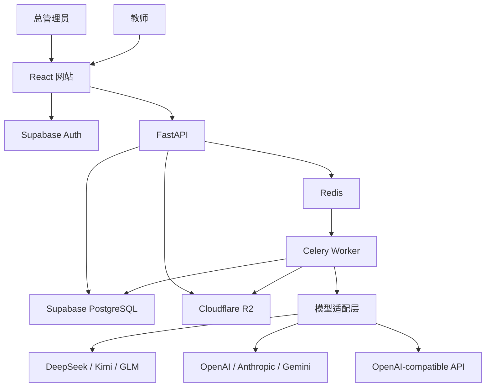

# 系统架构

## 1. 总体调用关系

## 2. 模块职责

| 模块/目录 | 职责 |
|---|---|
| `frontend/` | 登录、管理、作业、上传、批次进度、复核和导出界面 |
| `frontend/src/app/` | App Shell、路由、双语文案、界面状态和设计变量 |
| `backend/app/api/` | 对外 HTTP 接口、参数校验和权限入口 |
| `backend/app/config.py` | 显式校验运行环境和 PostgreSQL 连接配置 |
| `backend/app/readiness.py` | 执行有超时限制的数据库就绪探针 |
| `backend/app/auth/` | 验证 Supabase JWT、管理员和教师权限 |
| `backend/app/domain/` | Rubric、论文、评分结果、任务和审计数据结构 |
| `backend/app/providers/` | 屏蔽各模型 API 的协议、参数、错误和用量差异 |
| `backend/app/parsing/` | 将 DOCX/PDF 转换为可定位的规范文本块 |
| `backend/app/storage/` | 私有 R2 上传、读取、签名 URL 和对象生命周期 |
| `backend/app/workers/` | Celery 批量调度、幂等、重试和状态更新 |
| `backend/app/export/` | 生成草稿和最终成绩 Excel |
| `supabase/migrations/` | 表结构、约束、索引、角色和 RLS 策略 |
| `infra/` | Render、R2、健康检查和维护任务配置；当前只落地前端与 API Blueprint |
| `docs/design/` | App Shell 概念图和可执行视觉规范 |
| `e2e/` | 管理员与教师的浏览器全流程测试 |

## 3. 核心数据流

### 账户

1. 管理员通过后端邀请教师。
2. 后端使用服务端 Supabase 权限发送邀请。
3. 教师设置密码并获得 JWT。
4. 所有教师业务请求携带 JWT，由 FastAPI 和 RLS 双重校验。

### 作业与评分标准

1. 教师创建作业并输入题目与原始 Rubric。
2. 默认模型将 Rubric 转换为结构化草稿。
3. 教师确认后冻结 `rubric_version`。
4. 修改评分标准会创建新版本，不覆盖历史版本。

### 论文批改

1. 教师批量上传论文。
2. 后端预检、计算哈希并存入私有 R2。
3. 解析器生成带定位信息的规范文本块。
4. API 建立批次并将单篇任务交给 Celery。
5. Worker 固定使用批次指定的供应商和模型。
6. 模型结果通过 Schema、分值和证据校验。
7. 后端计算总分并保存不可变评分尝试。
8. 教师复核后生成最终成绩版本。

### 导出

1. 教师选择草稿或最终成绩导出。
2. 后端检查复核状态。
3. 导出模块生成 Excel 并记录审计信息。

## 4. 关键设计决定

### 可审计流水线，不使用开放式自治智能体

评分必须遵循固定输入、固定 Rubric、结构化输出和教师确认。开放式自治智能体会增加不可控工具调用和评分漂移，因此首版不采用。

### 模型只评分，后端算总分

模型只返回分项分数、理由、证据和建议；总分由后端确定性计算，避免算术错误和重复扣分。

### 供应商适配器与通用协议并存

DeepSeek、Kimi 和 GLM 虽提供兼容接口，但结构化输出、思考参数和错误格式仍不同。保留独立适配器，同时提供受限制的通用兼容适配器。

### RLS 是最终数据隔离边界

前端隐藏和后端过滤不能替代数据库隔离。教师业务访问携带用户 JWT，使 Supabase RLS 始终参与授权。

### PostgreSQL 保存状态，R2 保存大对象

数据库只保存账户、元数据、精简评分和审计记录；论文、提取文本、原始模型响应和备份进入 R2，以控制免费数据库容量。

### 失败显式暴露

文档解析、模型结构、证据定位和权限检查失败时进入明确错误状态；不自动换模型、不猜测补分、不静默截断。

## 5. 安全边界

- API Key 加密保存在服务端，浏览器永远不可见。
- 自定义 Base URL 限制为 HTTPS，并阻止内网地址。
- 论文内容视为不可信数据，不能修改系统评分指令。
- R2 对象默认私有，只通过短时签名 URL 访问。
- 管理员管理账户与系统，默认不提供论文正文读取接口。
- 未经教师确认的结果不能导出为最终成绩。

## 6. 当前状态

阶段 1 已完成：前后端工程、基础 App Shell、健康检查、迁移基线、环境模板和 Render 规划均已验证。当前下一步是阶段 2“Supabase 数据库”，执行顺序仍以 `docs/DEVELOPMENT_PLAN.md` 和 `task_plan.md` 为准。
