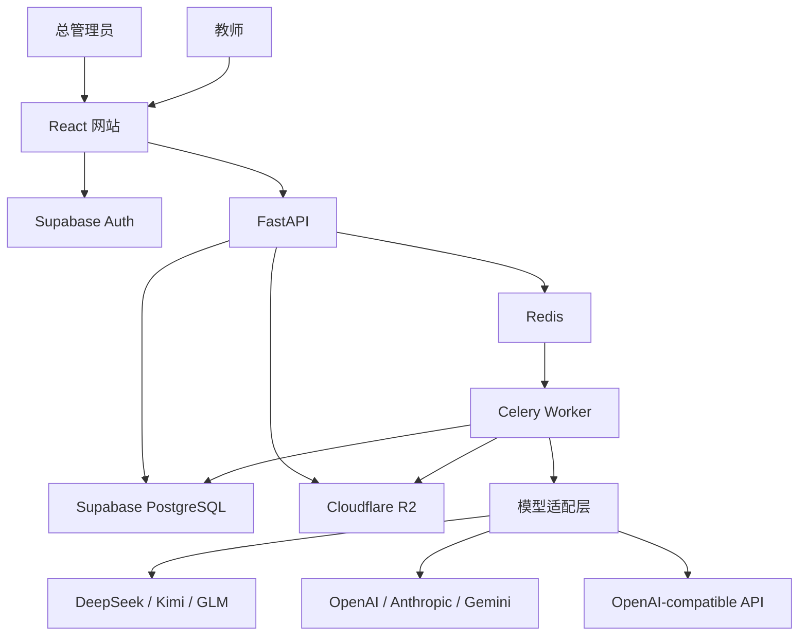

# 系统架构

## 1. 总体调用关系

## 2. 模块职责

| 模块/目录 | 职责 |
|---|---|
| `frontend/` | 登录、管理、作业、上传、批次进度、复核和导出界面 |
| `frontend/src/app/` | App Shell、路由、双语文案、界面状态和设计变量 |
| `backend/app/api/` | 对外 HTTP 接口、参数校验和权限入口 |
| `backend/app/config.py` | 显式校验运行环境和 PostgreSQL 连接配置 |
| `backend/app/db.py` | 创建有上限的应用连接池和异步数据库会话 |
| `backend/app/readiness.py` | 执行有超时限制的数据库就绪探针 |
| `backend/app/auth/` | 验证 Supabase JWT、管理员和教师权限 |
| `backend/app/domain/` | 11 张业务表的持久化模型、状态词汇、约束和索引定义 |
| `backend/migrations/` | 唯一 Alembic 迁移版本链，负责表结构、约束、索引和 RLS |
| `backend/app/providers/` | 屏蔽各模型 API 的协议、参数、错误和用量差异 |
| `backend/app/parsing/` | 将 DOCX/PDF 转换为可定位的规范文本块 |
| `backend/app/storage/` | 私有 R2 上传、读取、签名 URL 和对象生命周期 |
| `backend/app/workers/` | Celery 批量调度、幂等、重试和状态更新 |
| `backend/app/export/` | 生成草稿和最终成绩 Excel |
| `infra/` | Render、R2、健康检查和维护任务配置；当前只落地前端与 API Blueprint |
| `docs/design/` | App Shell 概念图和可执行视觉规范 |
| `e2e/` | 管理员与教师的浏览器全流程测试 |

## 3. 核心数据流

### 账户

1. 管理员通过后端邀请教师。
2. 后端使用服务端 Supabase 权限发送邀请。
3. 教师设置密码并获得 JWT。
4. 所有教师业务请求携带 JWT，由 FastAPI 校验；阶段 4 再为每个数据库事务显式设置受限角色和 JWT claims，使 RLS 参与授权。

### 作业与评分标准

1. 教师创建作业并输入题目与原始 Rubric。
2. 默认模型将 Rubric 转换为结构化草稿。
3. 教师确认后冻结 `rubric_version`。
4. 修改评分标准会创建新版本，不覆盖历史版本。

### 论文批改

1. 教师批量上传论文。
2. 后端预检、计算哈希并存入私有 R2。
3. 解析器生成带定位信息的规范文本块。
4. API 建立批次并将单篇任务交给 Celery。
5. Worker 固定使用批次指定的供应商和模型。
6. 模型结果通过 Schema、分值和证据校验。
7. 后端计算总分并保存不可变评分尝试。
8. 教师复核后生成最终成绩版本。

### 导出

1. 教师选择草稿或最终成绩导出。
2. 后端检查复核状态。
3. 导出模块生成 Excel 并记录审计信息。

## 4. 关键设计决定

### 可审计流水线，不使用开放式自治智能体

评分必须遵循固定输入、固定 Rubric、结构化输出和教师确认。开放式自治智能体会增加不可控工具调用和评分漂移，因此首版不采用。

### 模型只评分，后端算总分

模型只返回分项分数、理由、证据和建议；总分由后端确定性计算，避免算术错误和重复扣分。

### 供应商适配器与通用协议并存

DeepSeek、Kimi 和 GLM 虽提供兼容接口，但结构化输出、思考参数和错误格式仍不同。保留独立适配器，同时提供受限制的通用兼容适配器。

### RLS 是最终数据隔离边界

前端隐藏和后端过滤不能替代数据库隔离。阶段 2 先为所有公开表启用 RLS 且不建策略，使普通 API 角色默认无权访问。HTTP 中的 JWT 不会自动进入 SQLAlchemy 连接；阶段 4 必须在每个教师事务内显式设置受限角色和 JWT claims，提交或回滚后由事务清除，验证通过前不开放业务接口。

### PostgreSQL 保存状态，R2 保存大对象

数据库只保存账户、元数据、精简评分和审计记录；论文、提取文本、原始模型响应和备份进入 R2，以控制免费数据库容量。

### 迁移与应用连接严格分开

Alembic 是唯一迁移事实源。应用使用有上限的持久连接池；生产部署通过启用 SSL 的 Supavisor session pooler 5432 访问数据库。迁移只读取启用 SSL 的 direct 连接地址，且从支持 IPv6 的受控环境运行；不回退到应用连接池地址，也不把迁移凭据注入 Render API。真实破坏性验收另用 `TEST_MIGRATION_DATABASE_URL`，禁止复用部署迁移库。

### 身份与历史记录由数据库兜底

`profiles.id` 必须引用 Supabase `auth.users.id`。首版账户只停用、不硬删除，因此该外键使用 `ON DELETE RESTRICT`。审计日志禁止更新和删除；模型评分只允许从运行中完成一次，完成后不可修改；教师复核草稿可以编辑，但确认后不可修改或删除。模型和教师分数上限必须与对应 Rubric 一致。

### 失败显式暴露

文档解析、模型结构、证据定位和权限检查失败时进入明确错误状态；不自动换模型、不猜测补分、不静默截断。

## 5. 安全边界

- API Key 加密保存在服务端，浏览器永远不可见。
- 自定义 Base URL 限制为 HTTPS，并阻止内网地址。
- 论文内容视为不可信数据，不能修改系统评分指令。
- R2 对象默认私有，只通过短时签名 URL 访问。
- 管理员管理账户与系统，默认不提供论文正文读取接口。
- 未经教师确认的结果不能导出为最终成绩。

## 6. 当前状态

阶段 1 已完成。阶段 2 的 11 张业务表模型、约束、索引、默认拒绝的 RLS、连接池和 Alembic 迁移已落地，普通自动化测试通过；真实 PostgreSQL/Supabase 迁移与非法数据写入验收尚未执行，因此阶段 2 保持进行中。
